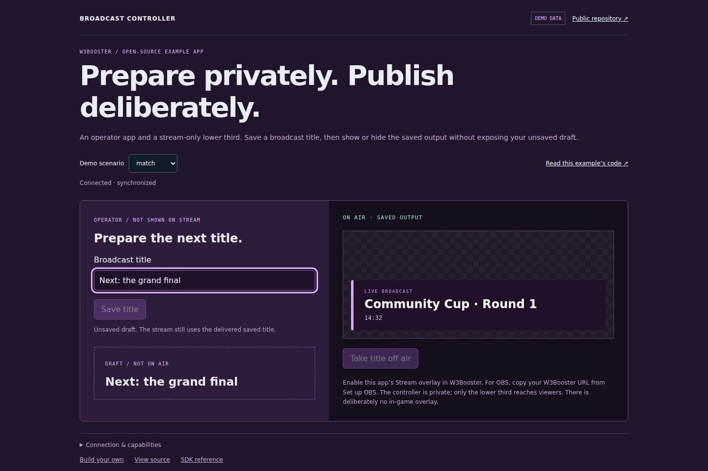

# Broadcast Controller

A focused W3Booster example by **W3Pad**. Prepare a broadcast title in a private operator window, then show the saved lower third to viewers. This uses an **application plus stream overlay**. There is deliberately no in-game overlay: the title is for the audience, not the player.

[Try the demo](https://w3booster.github.io/app-example-settings-playground/) · [Developer docs](https://website.w3booster.com/developer/) · [All examples](https://website.w3booster.com/developer/examples/)

The repository URL remains `app-example-settings-playground` so existing links and installations survive the workflow redesign.

## Run in one minute

Node.js 22.22.3 or newer. Demo mode needs no account, Warcraft III, desktop client, or database.

```sh
git clone https://github.com/W3Booster/app-example-settings-playground.git
cd app-example-settings-playground
npm ci
npm run dev
```

Open **http://localhost:5173/**. Expect **DEMO DATA** and **Connected · synchronized**. Edit **[src/controller.ts](src/controller.ts)** and watch the UI reload. Startup and teardown are in **[src/main.ts](src/main.ts)**; appearance is in **[src/controller.css](src/controller.css)**.

## Try the actual workflow

1. In W3Booster, open the controller and enable its Stream overlay.
2. Type a broadcast title. Only the draft preview changes.
3. **Save title** persists `display.title` through the authenticated host.
4. **Show saved title on stream** persists `display.onAir`; **Take title off air** hides it again.
5. Change either field in W3Booster's app settings: both real SDK consumers receive it.

The program reads resolved SDK settings, never the draft or a substituted acknowledgement. It starts **off air in live use**. The demo explicitly supplies a synthetic on-air fixture so output can be inspected, offers an off-air scenario, and disables persistence controls. It does not simulate successful saves.

Private drafts survive incoming settings updates and save acknowledgements. A newer typed draft is never replaced by an older save. While disconnected or not synchronized, output is hidden and host actions are disabled.

## Surfaces and minimum permissions

Register **Application** at `http://localhost:5173/?demo=0` and **Stream overlay** at `http://localhost:5173/?view=overlay&demo=0`. Leave In-game overlay unconfigured. Copy the two-field schema from `app-definition.json`; the stream and operator use the same app identity and separate SDK runtimes.

Data scopes: `match:read` (the lower-third game clock); settings writes use the discovered `settings:write` host capability. There are no unrelated data permissions. The app-definition file is the registration guide; `example.json` and the tested build manifest declare the same surfaces.

In W3Booster, turn on the configured **Stream** or **In-game** surface. For OBS, copy your W3Booster URL from **Set up OBS** and add it as a browser source. This one source displays all your enabled stream overlays; never paste a user launch URL into OBS.

## Fork and use live data

The overlay canvas uses the `normal` browser color scheme, matching the default
iframe configuration even though its painted UI is dark. Do not add forced-dark
HTML metadata. Browser tests verify real iframe transparency against colored
backgrounds under both light and dark host themes.

The checked-in binding identifies the official example. Cloning source does **not** grant ownership or live access.

1. Enable Developer Mode in W3Booster and create your own application.
2. Use [app-definition.json](app-definition.json) for the exact surfaces, scopes, and settings schema. Supply your own name and hosted URLs.
3. Replace the official binding safely:

   ```sh
   npm run app:fork -- YOUR_NEW_CLIENT_ID
   npm run check
   ```

4. Use **Test locally** with the configured surface URLs above, then launch through W3Booster. Commit the new binding and package configuration.

Direct visits default to offline demo data. Registered live URLs must include `demo=0`. Failed authorization never silently falls back to synthetic data. The application runs with browser APIs and the SDK; it has no arbitrary shell or filesystem access.

## Verify and publish

```sh
npm run check
npm run build
npx playwright install chromium
npm run test:browser
npm run screenshots
```

Tests exercise the real workflow, minimal scopes, configured surfaces, mobile layout, demo/live isolation, and authorization failures; a second test delivers settings to two real SDK runtimes and verifies drafts, on/off-air output, and teardown. Screenshots capture the real UI, not a mockup.



The included GitHub Actions workflow checks the project and deploys `dist/` to Pages. Enable **Settings → Pages → GitHub Actions** in your fork and replace the official URLs. The build uses the checked-in SDK lockfile and does not fetch private data. Its `example-bindings.json` records the binding actually compiled and the tested supported surfaces.

After editing your registered contract, run `npm run w3booster:sync`; `npm run w3booster:check` verifies the current public definition. Never put credentials or real user captures into the repository or Pages secrets.

For a complete Angular starting point, [build from Match Vision](https://website.w3booster.com/developer/match-vision/). All examples remain together in the [example library](https://website.w3booster.com/developer/examples/).

MIT licensed; retain [LICENSE](LICENSE) when reusing source. No Warcraft artwork is bundled.
